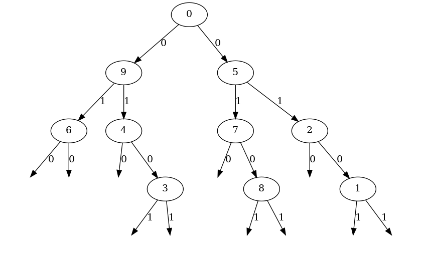
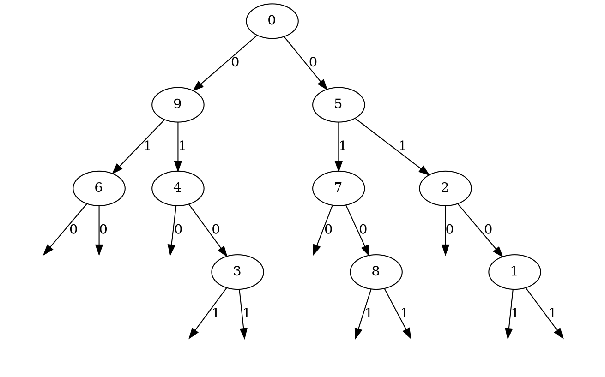

# kdtree

header-only implementation of kdtree and visualization.

following features are implemented.

* Nearest neighbor search
* k-Nearest neighbor search
* Spherical range search
* Graphviz dot language output

|filename|description|
|:--|:--|
|`include/kdtree.h`|header-only implementation of kdtree|
|`examples/search.cpp`|visualization of neighbor search result|

## Requirements

* C++17
* CMake 3.12 or Higher

if you want to build visualization programs, you also need followings.

* OpenGL 3.1
* [SFML 2.5](https://github.com/SFML/SFML)

## How to integrate kdtree into your cmake project

in your CMakeLists.txt

```cmake
add_subdirectory(<path-to-kdtree>)
target_link_libraries(<your-target> kdtree)
```

## How to use kdtree in your source

```cpp
// include kdtree
#include "kdtree/kdtree.h"

// setup points 
std::vector<Point> points;
// populate points here...

// setup kdtree
kdtree::KdTree<Point> tree(points);
// build kdtree
tree.buildTree();

// nearest neighbor search
Point queryPoint = ...
int index_of_nearest = tree.searchNearest(queryPoint);

// k-nearest neighbor search
int k = 5;
std::vector<int> indices_of_k_nearest = tree.searchKNearest(queryPoint, k);

// spherical range search
float r = 1.5;
std::vector<int> indices_of_range = tree.sphericalRangeSearch(queryPoint, r);
```

**Note that `Point` must have following members.**

* `T Point::operator[](unsigned int) const`: element access
* `static unsigned int Point::dim`: number of dimension

## How to build visualization programs

Run following command to retrieve external libraries.

```bash
git submodule update --init
```

Then, set cmake option `KDTREE_VISUALIZATION` to `On` and build.

```bash
mkdir build
cd build
cmake -DCMAKE_BUILD_TYPE=Release -DKDTREE_VISUALIZATION=On ..
make
```

## Gallery

### Graphviz dot language output



generated dot file


## Externals

* [SFML 2.5](https://github.com/SFML/SFML)
* [imgui](https://github.com/ocornut/imgui)
* [imgui-sfml](https://github.com/eliasdaler/imgui-sfml)

## References

* [C言語によるkd-treeの実装](https://qiita.com/fj-th/items/1bb2dc39f3088549ad6e)
* [kd-treeを実装してみた](https://atkg.hatenablog.com/entry/2016/12/18/002353)
* [kd-tree (2次元)](https://tjkendev.github.io/procon-library/cpp/range_query/kd-tree.html)
* [k-d treeによる最近傍探索](https://github.com/komi2/survey/blob/master/01/01/kdtree.md)